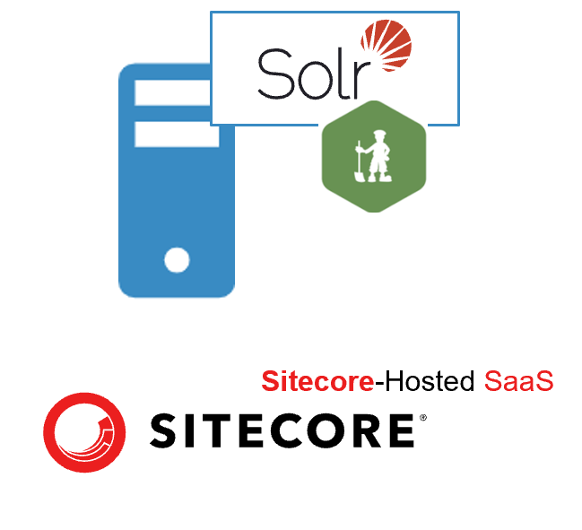
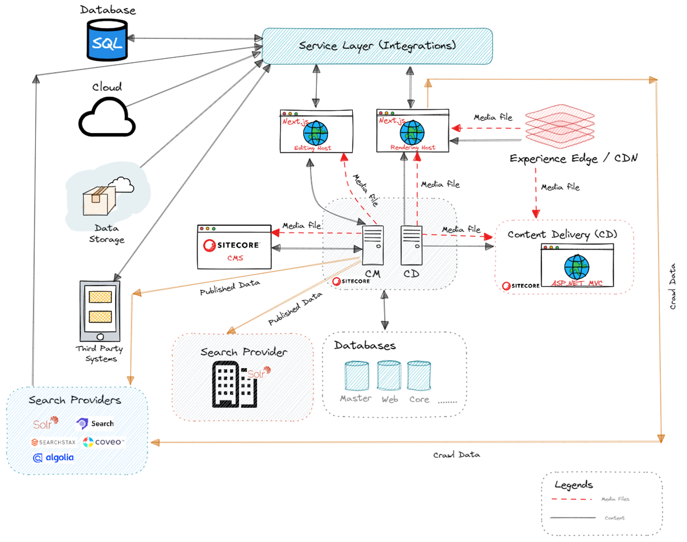
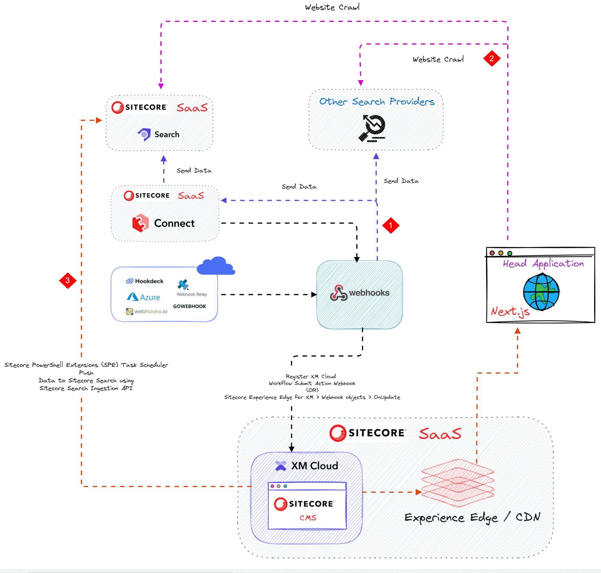

## Search

In XM Cloud based Sitecore implementations, the Search implementation required for two types of applications:

- <strong>Content Managment (CM)</strong>
- <strong>Front-end (FE)</strong>

### Content Managment (CM)

The Content Managment System (backend system) enables authors to create, manage and publish content, and uses the Search indexes to search the content e.g., Content Authors can quickly search required item in the Content Tree with the help of advanced search functionality such as search filters and facets.

When you are working with the Sitecore Content Management system (traditional or headless), you can use the default search provider Solr, for internal Sitecore CMS search.

The search instance for CM provision by the Sitecore (SaaS offering) and wouldn't be available for developers for any modifications (or) for end-user's usage.

### Front-end (FE)

The Search instance for the FE app is used to meet the search needs of the FE app. It is the responsibility of the client or implementation partner to set it up.

In Sitecore XMC, the Content Delivery role isn't needed because the website isn't hosted in XM Cloud (in XMC front-end website can be hosted on Vercel or other hosting providers based on your needs.). XMC publishes the CMS content to Sitecore Experience Edge, not to the web database (so the content is indexed in the web index).

The XM Cloud content delivery Experience Edge provides an Edge GraphQL endpoint, allowing the front-end app to retrieve the presentation details of the page from the CMS to construct the page.

For enhancing search functionality and user experience on your website, you can use <strong>[Sitecore Search](https://doc.sitecore.com/search/en/users/search-user-guide/overview-of-search-features.html)</strong> to easily index content from documents and websites. It provides the tools and support needed for content retrieval and discovery.

There are other options available in the market to index or crawl website content and documents, such as Solr (with Zookeeper), [SearchStax (SaaS)](https://www.searchstax.com/blog/search-for-sitecore-xm-cloud/), [Coveo (SaaS)](https://www.coveo.com/blog/coveo-sitecore-xm-cloud/), and more.

Read more about `Sitecore Search` [here](https://doc.sitecore.com/search/en/developers/search-developer-guide/getting-started-with-sitecore-search.html)

## Reference Architecture

Please find below high-level reference architectures for Sitecore Headless implementations

### Different ways to access content and media items, plus integration with search providers and third-party systems

The diagram above shows the Sitecore ASP.NET MVC and Sitecore Headless application with options for content delivery, media items, and search providers.

If you are working with a Sitecore Headless implementation, the easiest way to index data is by using Sitecore Search. This can be done through website crawling without any custom implementation or the installation of a connector.

### Integrate XM Cloud with Sitecore Search

You can index website content in XM Cloud in these ways:

<strong>1.</strong> You can use the Sitecore XM Cloud Workflow notification to determine which content state has changed and send specific data to Sitecore Search through the Webhook.

The Sitecore XM Cloud provides three types of webhooks:

- Webhook event handler

- Webhook submit action

- Webhook validation action

For our use case, we can use the [Webhook submit action](https://doc.sitecore.com/xmc/en/developers/xm-cloud/walkthrough--adding-and-configuring-a-webhook-submit-action.html) when an item moves to the approved state. The XM Cloud workflow webhook will then send the notification to the specific endpoints with the required data.

You can also try the **Edge Webhook’s OnUpdate** event to get the updated data directly from Sitecore Experience Edge. You can find more details at [Sitecore Experience Edge for XM > Webhook objects](https://doc.sitecore.com/xmc/en/developers/xm-cloud/webhook-objects.html#entityupdate).

With this approach, we can utilise Sitecore Connect, which will send the data to Sitecore Search for indexing with its `Low-code` / `No-code` integration platform.

You can create a custom [Workato Webhooks connector](https://docs.workato.com/connectors/workato-webhooks.html) and use it in [Sitecore Connect](https://doc.sitecore.com/connect/en/users/sitecore-connect/introduction-to-sitecore-connect.html) (Sitecore's SaaS product).

<strong>2.</strong> You can use `Sitecore Search` [Advance Web Crawler](https://doc.sitecore.com/search/en/users/search-user-guide/walkthrough--configuring-an-advanced-web-crawler.html) to crawl the data (or content) from your website.

<strong>3.</strong> You can also use the [Sitecore PowerShell Extensions (SPE)](https://doc.sitecorepowershell.com/) [`task scheduler`](https://doc.sitecorepowershell.com/modules/integration-points/tasks) to run scripts at specific times. This means you can create an SPE script that checks the state of items and pushes those items to Sitecore Search using the Sitecore Search [Ingestion API](https://doc.sitecore.com/search/en/developers/search-developer-guide/using-the-ingestion-api-to-add-content-to-an-index.html).

> 💡 Sitecore XM Cloud is a SaaS platform, so we need to avoid deploying any custom code to the Sitecore XM CMS instance.
