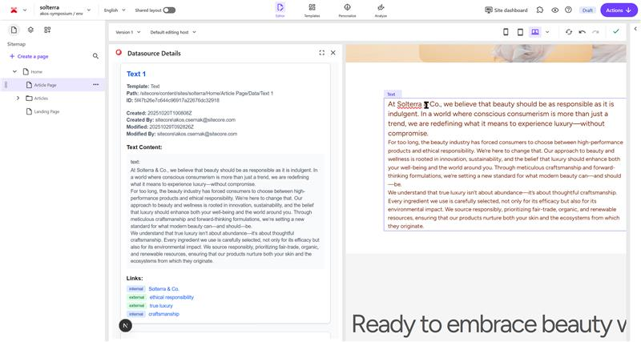

# Use case: Data source (Akos)

This workshop focuses on an advanced use case for developers and power users working within Sitecore XM Cloud.

The goal is to demonstrate how to programmatically display the actual data source item (the content item providing the data) being used by a rendering directly on the page, visible to content authors in the XM Cloud Pages editor.

This use case requires leveraging GraphQL queries to efficiently retrieve real-time context about the page structure and the item data source being referenced by the component. You will learn how to:

- Utilize Next.js and the Sitecore Headless SDK.
- Execute advanced GraphQL queries to traverse the content tree and fetch presentation details.
- Enhance the in-context editing experience by exposing technical information to content authors, making troubleshooting and content management more intuitive.



[Reference Repository](https://github.com/Sitecore/hackerspace-workshop/app/data-source)

Extension Point: **Page Context**

## Summary

This tool or application provides content authors and developers with real-time transparency into the data powering their XM Cloud pages.

It's designed to visually display the data source items being consumed by components on the current page, and also renders a summary of the key content fields within those data source items. This eliminates guesswork, accelerates debugging, and ensures content creators always know exactly where the content they see on the page is coming from.

## Implementation Steps

- Check App Config
- Initial app creation
- Fix page subscription
- Fix GraphQL

### Step 1. Check App Config
Revisit the Developer Studio to check if you have chosen the right extension point for this app. 


### Step 2. Initial app creation
Prompt
```
Create a Sitecore Marketplace app using React Vite. I want the app to appear in XM Cloud Page builder. Using XM Cloud APIs including the GraphQL API, the app should display the details of every datasource available in the currently opened XM Cloud page.

The datasource details should include: the name of the datasource, which user created it, which user last modified it, date of creation, date of last modified, the text contents of the datasource, internal links in the text datasource, external links in the text datasource.

## Project setup
Create the app in the currently open folder. Don't create a subfolder.
Make sure the developer server starts on http://localhost:5173.
Install the Marketplace SDK packages at their `latest` versions.

## Important notes
- Because the app needs to use XM Cloud APIs, make sure to initialize the `xmc` package of the SDK, which holds XM Cloud API functionality.
- In the XM Cloud page context, the page information is stored in `pageContext.pageInfo` (with properties like `id` and `path`), not `pageContext.item`.
```

### Step 3. Fix page subscription
Prompt
```
That worked, thanks! The Marketplace app successfully loads in XM Cloud Page builder.

But there  is an issue. When I open a different page in XM Cloud, I want to see details for that page.
```
### Step 4. Fix GraphQL
Prompt
```
The Marketplace app loads in XM Cloud just fine. But the datasources are not displaying in the Marketlace app.
Fix the XM Cloud GraphQL API calls to correctly retrieve datasources. Before you fix the code, read the relevant Sitecore docs again (Marketplace, Marketplace SDK, XM Cloud GraphQL API and queries).

## Important notes
- In the XM Cloud page context GraphQL API, the page information is stored in `pageContext.pageInfo` (with properties like `id` and `path`), not `pageContext.item`.
- In the GraphQL API, use `responseData.data.dataFolder` because the GraphQL response has a nested data property:
  - response.data.data.dataFolder  // ✅ Correct
  - response.data.dataFolder  // ❌ Wrong
The SDK wraps the GraphQL response, so we need to access response.data.data to get to the actual GraphQL data.  

## Troubleshoot
Previously, another AI agent made these mistakes:

Problems:
- Wrong GraphQL query approach: Initially tried to parse presentation details and query each datasource individually
- Incorrect field names: Used results instead of nodes for GraphQL collections
- Wrong response access pattern: Accessed response.data.dataFolder instead of response.data.data.dataFolder


Solution:
- Followed the Get page contents including datasources example from the documentation: example-graphql-requests-responses.md
- Query the /Data folder directly under the page path
- Use children { nodes { ... } } for collections (not results)
- Access response through SDK wrapper: response.data.data.dataFolder (nested data property)
- Changed fields.results to fields.nodes throughout
```

## Resources
Essential links for AI-powered Sitecore marketplace development:

- [Workshop Setup Guide](index.md) - Complete preparation steps
- [Sitecore Marketplace SDK Documentation](https://doc.sitecore.com/mp/en/developers/sdk/latest/sitecore-marketplace-sdk/)
- [Blok Shadcn Registry](https://blok-shadcn.vercel.app/) - UI components for rapid development
- [Sitecore MCP Documentation](https://doc.sitecore.com/mcp) - AI assistance integration
- [Hugging Face Inference API](https://huggingface.co/docs/api-inference/index)
- [Next.js App Router Documentation](https://nextjs.org/docs/app)
- [Sitecore Marketplace Developer Portal](https://developers.sitecore.com/marketplace)