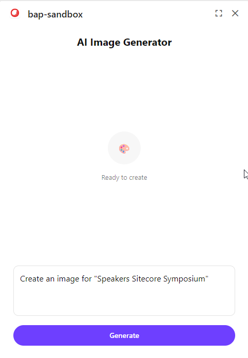

# Use case: AI Image Generator for Sitecore Marketplace

Build an ultra-compact AI-powered image generator that integrates with Sitecore page context to create contextual images using free AI services.



[Reference Repository](https://github.com/Sitecore/hackerspace-workshop/app/image-generator)

## Summary

This tutorial demonstrates how to build a lean AI image generator that automatically detects the current Sitecore page context and generates relevant images using the free Hugging Face Stable Diffusion XL model. The extension showcases integration with the Sitecore Marketplace SDK for real-time context updates and external AI API integration.

Key features:
- Auto-detects page `displayName` from Sitecore context
- Real-time updates when navigating between pages
- Free AI image generation (no API keys required)
- One-click download functionality
- Ultra-compact and efficient codebase

## Implementation Steps

Follow these steps to build your own AI image generator from scratch:

- Set up Next.js project with Sitecore Marketplace SDK
- Create the image generator component with context integration
- Implement the AI generation API endpoint
- Add download functionality and error handling  
- Test and optimize the user experience

### Step 1. Project Setup

Create a new Next.js project and install the required dependencies for Sitecore Marketplace integration.

```bash
# Create Next.js project with TypeScript
npx create-next-app@latest ai-image-generator --typescript --tailwind --eslint --app --src-dir=false --import-alias="@/*"

cd ai-image-generator

# Install Sitecore Marketplace SDK
npm install @sitecore-marketplace-sdk/client

# Install shadcn/ui components
npx shadcn@latest init
npx shadcn@latest add card button alert
```

### Step 2. Create the Marketplace Provider

Set up the Sitecore Marketplace provider to enable context queries throughout your application.

```typescript
// components/providers/marketplace.tsx
"use client";

import { createContext, useContext, useEffect, useState } from "react";
import { ClientSDK } from "@sitecore-marketplace-sdk/client";

const MarketplaceContext = createContext<ClientSDK | null>(null);

export function MarketplaceProvider({ children }: { children: React.ReactNode }) {
  const [client, setClient] = useState<ClientSDK | null>(null);

  useEffect(() => {
    const initClient = async () => {
      try {
        const sdk = new ClientSDK();
        setClient(sdk);
      } catch (error) {
        console.error("Failed to initialize Marketplace SDK:", error);
      }
    };

    initClient();
  }, []);

  return (
    <MarketplaceContext.Provider value={client}>
      {children}
    </MarketplaceContext.Provider>
  );
}

export const useMarketplaceClient = () => useContext(MarketplaceContext);
```

### Step 3. Create the AI Generation API

Build the backend API endpoint that handles image generation using Hugging Face's free Stable Diffusion XL model.

```typescript
// app/api/generate-image/route.ts
import { NextRequest, NextResponse } from 'next/server';

const HF_API_URL = 'https://api-inference.huggingface.co/models/stabilityai/stable-diffusion-xl-base-1.0';

export async function POST(request: NextRequest) {
  try {
    const { prompt } = await request.json();
    
    if (!prompt) {
      return NextResponse.json({ error: 'Prompt is required' }, { status: 400 });
    }

    const response = await fetch(HF_API_URL, {
      method: 'POST',
      headers: {
        'Content-Type': 'application/json',
        ...(process.env.HUGGINGFACE_API_TOKEN && {
          'Authorization': `Bearer ${process.env.HUGGINGFACE_API_TOKEN}`
        }),
      },
      body: JSON.stringify({ inputs: prompt }),
    });

    if (!response.ok) {
      const message = response.status === 503 
        ? 'Model loading, please try again in a moment'
        : response.status === 429 
        ? 'Rate limit exceeded, please try again later'
        : 'Failed to generate image';
      
      return NextResponse.json({ error: message }, { status: response.status });
    }

    const imageBlob = await response.blob();
    const buffer = Buffer.from(await imageBlob.arrayBuffer());
    const imageUrl = `data:image/jpeg;base64,${buffer.toString('base64')}`;

    return NextResponse.json({ imageUrl });

  } catch {
    return NextResponse.json(
      { error: 'Failed to generate image' },
      { status: 500 }
    );
  }
}
```

### Step 4. Build the Main Component

Create the core image generator component that integrates with Sitecore context and handles the complete user workflow.

```typescript
// app/image-generator/components/image-generator-panel.tsx
"use client";

import { useMarketplaceClient } from "@/components/providers/marketplace";
import { Card, CardContent } from "@/components/ui/card";
import { Button } from "@/components/ui/button";
import { Alert, AlertDescription } from "@/components/ui/alert";
import { useState, useEffect } from "react";
import Image from "next/image";

export function ImageGeneratorPanel() {
  const client = useMarketplaceClient();
  const [isGenerating, setIsGenerating] = useState(false);
  const [error, setError] = useState<string | null>(null);
  const [generatedImage, setGeneratedImage] = useState<string | null>(null);
  const [prompt, setPrompt] = useState<string>("Create a professional image.");

  useEffect(() => {
    if (!client) return;
    
    const init = async () => {
      try {
        const response = await client.query("pages.context");
        const name = response.data?.pageInfo?.displayName || response.data?.pageInfo?.name;
        if (name) setPrompt(`Create an image for "${name}"`);
        
        await client.query("pages.context", {
          subscribe: true,
          onSuccess: (data) => {
            const name = data?.pageInfo?.displayName || data?.pageInfo?.name;
            if (name) setPrompt(`Create an image for "${name}"`);
          },
        });
      } catch {
        setError("Failed to connect to Sitecore");
      }
    };
    
    init();
  }, [client]);

  const generate = async () => {
    if (!prompt.trim()) return;
    
    setIsGenerating(true);
    setError(null);
    
    try {
      const response = await fetch('/api/generate-image', {
        method: 'POST',
        headers: { 'Content-Type': 'application/json' },
        body: JSON.stringify({ prompt: prompt.trim() }),
      });
      
      const data = await response.json();
      if (data.imageUrl) {
        setGeneratedImage(data.imageUrl);
      } else {
        throw new Error(data.error || 'Generation failed');
      }
    } catch (err) {
      setError(err instanceof Error ? err.message : "Generation failed");
    } finally {
      setIsGenerating(false);
    }
  };

  const downloadImage = () => {
    if (!generatedImage) return;
    
    try {
      const base64Data = generatedImage.split(',')[1];
      const byteCharacters = atob(base64Data);
      const byteNumbers = new Array(byteCharacters.length);
      for (let i = 0; i < byteCharacters.length; i++) {
        byteNumbers[i] = byteCharacters.charCodeAt(i);
      }
      const byteArray = new Uint8Array(byteNumbers);
      const blob = new Blob([byteArray], { type: 'image/jpeg' });
      
      const url = URL.createObjectURL(blob);
      const a = document.createElement('a');
      a.href = url;
      a.download = `ai-image-${Date.now()}.jpg`;
      document.body.appendChild(a);
      a.click();
      document.body.removeChild(a);
      URL.revokeObjectURL(url);
    } catch (error) {
      console.error('Download failed:', error);
    }
  };

  return (
    <div className="max-w-2xl mx-auto p-4 space-y-4">
      <div className="text-center">
        <h1 className="text-2xl font-bold">AI Image Generator</h1>
      </div>

      {error && (
        <Alert>
          <AlertDescription>⚠️ {error}</AlertDescription>
        </Alert>
      )}

      <Card>
        <CardContent className="p-4">
          <div className="min-h-[300px] flex items-center justify-center">
            {isGenerating ? (
              <div className="text-center">
                <div className="h-16 w-16 bg-blue-100 rounded-full mx-auto flex items-center justify-center animate-pulse mb-4">
                  <span className="text-2xl">🎨</span>
                </div>
                <p className="text-sm text-muted-foreground">Generating...</p>
              </div>
            ) : generatedImage ? (
              <div className="text-center space-y-4">
                <Image 
                  src={generatedImage} 
                  alt="Generated" 
                  width={400}
                  height={400}
                  className="max-w-full h-auto rounded-lg"
                />
                <div className="flex gap-2 justify-center">
                  <Button onClick={downloadImage} variant="outline" size="sm">
                    Download
                  </Button>
                  <Button onClick={() => setGeneratedImage(null)} variant="outline" size="sm">
                    New
                  </Button>
                </div>
              </div>
            ) : (
              <div className="text-center">
                <div className="h-16 w-16 bg-muted rounded-full mx-auto flex items-center justify-center mb-4">
                  <span className="text-2xl">🎨</span>
                </div>
                <p className="text-muted-foreground text-sm">Ready to create</p>
              </div>
            )}
          </div>
        </CardContent>
      </Card>

      <div className="space-y-3">
        <textarea
          className="w-full p-3 border rounded-lg resize-none"
          rows={3}
          value={prompt}
          onChange={(e) => setPrompt(e.target.value)}
          placeholder="Describe your image..."
        />
        
        <Button 
          onClick={generate} 
          disabled={isGenerating || !prompt.trim()}
          className="w-full"
        >
          {isGenerating ? "Generating..." : "Generate"}
        </Button>
      </div>
    </div>
  );
}
```

### Step 5. Create Page Structure

Set up the minimal page structure and layout for your image generator route.

```typescript
// app/image-generator/layout.tsx
export const metadata = { title: "AI Image Generator" };
export default function Layout({ children }: { children: React.ReactNode }) {
  return children;
}
```

```typescript
// app/image-generator/page.tsx
import { MarketplaceProvider } from "@/components/providers/marketplace";
import { ImageGeneratorPanel } from "./components/image-generator-panel";

export default function Page() {
  return (
    <MarketplaceProvider>
      <ImageGeneratorPanel />
    </MarketplaceProvider>
  );
}
```

### Step 6. Environment Configuration (Optional)

Add a Hugging Face API token for better performance and higher rate limits.

```bash
# .env.local (optional - works without API token)
HUGGINGFACE_API_TOKEN=your_token_here
```

### Step 7. Test and Deploy

Run your application and test all functionality:

```bash
# Start development server
npm run dev

# Navigate to: http://localhost:3000/image-generator
# Test: Context detection, image generation, download functionality
```

## Resources

Essential links and documentation for building AI-powered Sitecore extensions:

- [Sitecore Marketplace SDK Documentation](https://doc.sitecore.com/mp/en/developers/sdk/latest/sitecore-marketplace-sdk/)
- [Hugging Face Inference API](https://huggingface.co/docs/api-inference/index)
- [Next.js App Router Documentation](https://nextjs.org/docs/app)
- [shadcn/ui Components](https://ui.shadcn.com/)
- [Sitecore Marketplace Developer Portal](https://developers.sitecore.com/marketplace)